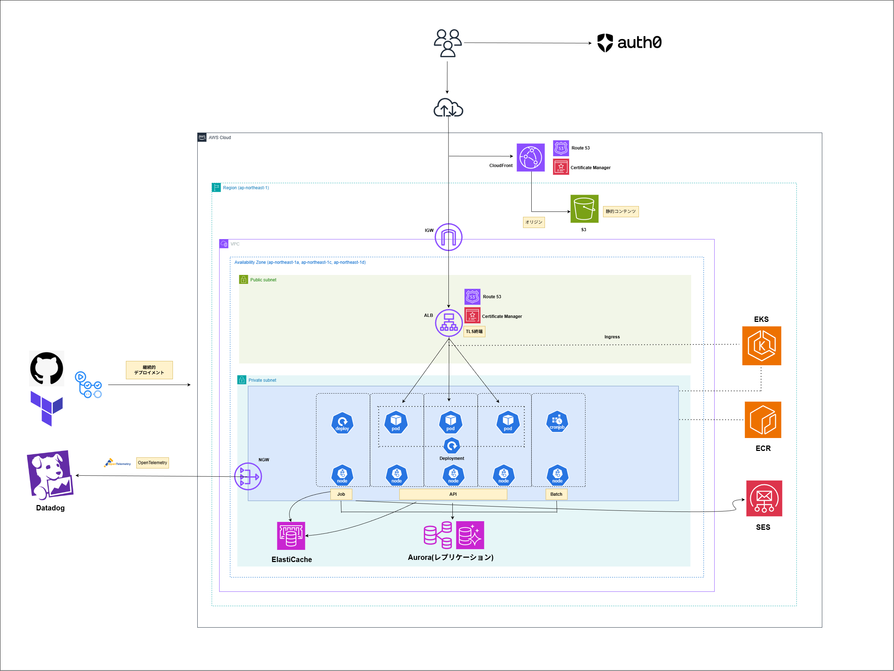

# career-roadmap-app

自分のキャリアを図(タイムライン等)で可視化・共有するアプリケーション。面接時の自己紹介ツールを主用途とし、共有された他者のキャリアをロールモデルやキャリアチェンジの参考として閲覧する用途も想定する。

## 背景

本プロジェクトは **Kubernetes (EKS) の学習を第一目的** とした個人プロジェクトである。プロダクトとしての収益化よりも、EKS を中心とした AWS 上での production-grade なアーキテクチャを自分で構築・運用する経験を得ることを主眼に置いている。そのため、立ち上げ期のトラフィック規模に対しては意図的にオーバースペックな構成を採用している。

## ドキュメント

詳細は [`docs/`](./docs/) を参照。

## アーキテクチャ

